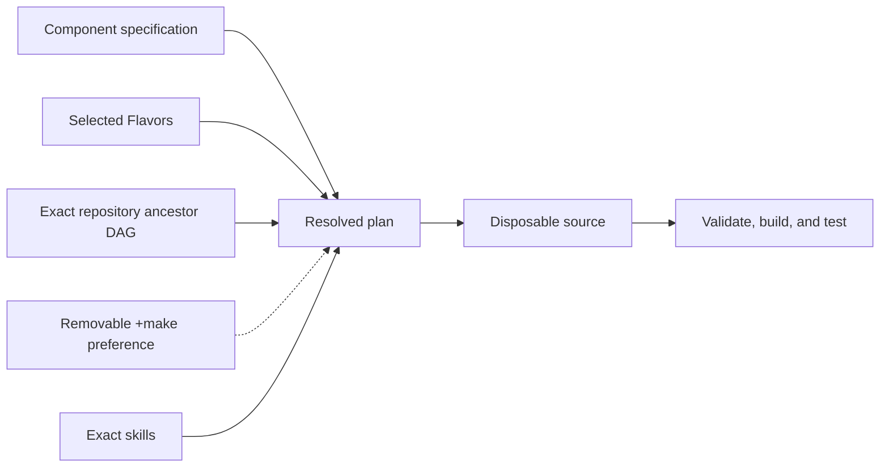

# Project guide

Project Tracker is a repository and task workspace with a Trello-style live board,
physical coding-session visibility and Git branch visualizations. Its backend owns
the database, MAC integration, MCP and A2A peer protocols, and LLM credentials.
The product objective in `PROJECT.md` and application specification in `components/tracker/component.md`
define the complete outcome; the application is currently under construction.

Start with [getting started](user/getting-started.md) for installation and usage.
See [active work](roadmap/active-work.md) for current development status.

## Development

This project is built with [Literate AI](https://github.com/NVIDIA-dev/literate-ai).
The [framework flow](user/framework-flow.md) explains the specification-led lifecycle,
and the [project map](user/project-layout.md) identifies the authority for a change.

See [readable specifications](user/specifications.md),
[models and generation](user/models-and-generation.md),
[private test matrices](user/test-matrix.md),
[security](user/security.md), [skill boundaries](architecture/skills.md), and the
[authority learning loop](architecture/authority-learning-loop.md), the
[mission-specification map](architecture/mission-specification-composition.md), and the
[traceability rule](architecture/design-traceability.md) when those concerns apply.

Initialize from an organization or product repository with
`litai init PATH --from URL[#REVISION]`. Literate AI resolves every ancestor without
executing repository code, then records exact commits and inherited catalog provenance.
Use `litai update` to re-resolve that chain and `litai reparent URL|none` to review an
explicit parent change.
