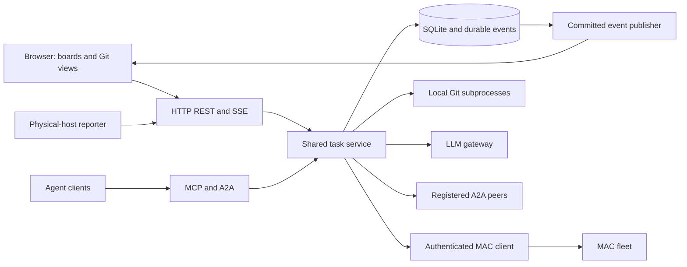

# Application architecture

[Documentation](../README.md)

Project Tracker is one Node.js service with a semantic HTML/CSS/JavaScript frontend.
SQLite stores repositories, tasks, workflow states, sessions, settings, peers and durable
events. The browser renders views and sends operations to the backend; it does not hold
MAC or LLM credentials or access Git directly.

## Authority and persistence

Repository authority is local, MAC or unresolved. Local task operations mutate the local
store. MAC task operations call upstream endpoints and import the authoritative result.
Unresolved authority blocks writes that would incorrectly assume absence. Every protocol
adapter uses this decision; none should bypass it through a direct local store write.

SQLite uses WAL, foreign keys and transactional schema changes. A local task update and
its event row commit together. A fleet snapshot builds complete task projections and
commits atomically. Revisions and events change once per genuinely changed task; identical
polls leave them stable. Notifications are delivered only after commit, so rolled-back
changes cannot leak to connected browsers.

Tracker task IDs identify local read-store objects. MAC IDs identify upstream objects;
A2A task IDs identify durable protocol operations. Dependency translation is explicit
between these domains. Missing/foreign references retain their upstream identity even
when they cannot populate the ordinary same-project dependency selection.

## Background work

MAC polls are serialized, including overlapping scheduled and manual requests. Read and
write deadlines include response consumption, and failed synchronization preserves the
last-good task snapshot. Sync status changes notify clients independently from task changes.

Session reporters run beside actual coding CLI child processes on their physical hosts.
The server timestamps heartbeats and derives freshness. MAC assignments remain distinct
from verified reporter sessions. Git overlays use task branches and reported sessions,
including the original physical hostname.

## Interfaces

REST is described by `/openapi.json`. SSE provides ordered durable replay. MCP uses the
official SDK over stdio and Streamable HTTP. A2A 0.3.0 exposes message operations and durable
retry identities. Peer requests use backend-owned credentials and registered destinations.

Git executes bounded argv-based subprocesses against a local checkout without shell
interpolation or automatic clones. Graph edges come from real parent hashes. The assistant
uses a bounded context request through a configured chat-completions gateway and has no
implicit write or shell authority.

## Generation boundary

Application behavior is authored in `components/tracker/`. Runtime and dependency authority,
selected Flavors, exact conversion skills and the framework lifecycle determine the
candidate. Generated modules are replaceable output. Maintainer verification is separate
from native generated tests and binds results to the exact exported source.

See [development](../user/development.md), [project layout](../user/project-layout.md), and
[verification](../user/verification.md).
