# Framework flow

[Documentation](../README.md)

Specifications define behavior. Selected Flavors add target requirements; exact skills
guide conversion; workflows and routing constrain generation. This project selects
JavaScript, npm and macOS. It does not require an inherited framework Makefile or Bazel
build to operate the application.

```mermaid
flowchart LR
    Authority[Specifications and target authority] --> Lock[Lock and plan]
    Lock --> Generate[Generate candidate or exact cache hit]
    Generate --> Admit[Validate source and dependencies]
    Admit --> Build[Authorized build]
    Build --> Test[Native tests and service acceptance]
    Test --> Export[Accepted export and receipt]
    Export --> Independent[Independent runtime and browser checks]
```

Use `scripts/litai-service.sh` to select the installed toolchain and supported lifecycle.
Follow [development](development.md) for exact commands. Source generation alone is not
acceptance; a cache hit and a listening service are not proof of full product behavior.

[`literate.project.json`](../../literate.project.json) pins the Standard lifecycle
identity. Upgrading installed tooling does not authorize manually advancing that pin.
Use the framework's reviewed rebind flow when intentionally changing it. `litai update`
reconciles inherited files, while `litai reparent` changes repository ancestry; neither
is an ordinary application data upgrade.
