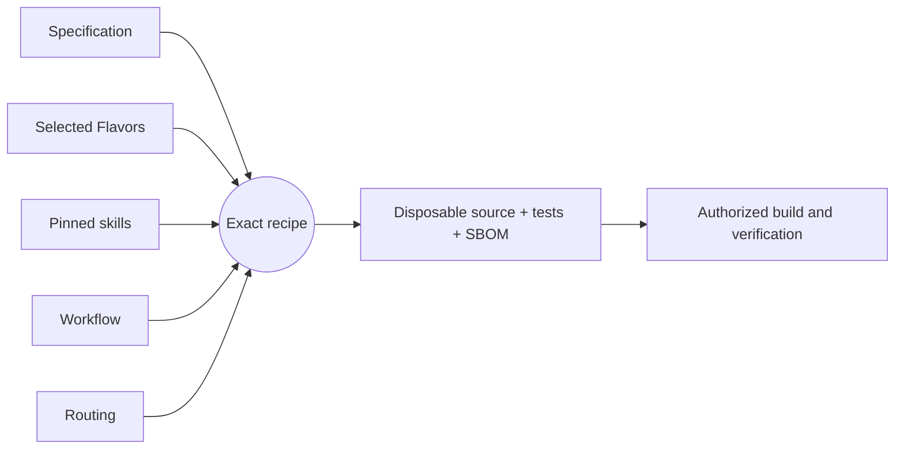

# Getting started

[Project guide](../README.md) → getting started

<!-- DOC-IDENTITY: Replace this section with your project's own description.
     A downstream project's getting-started document must describe the project
     itself — what it is, what it does, how to install and use it — not the
     framework that built it. Delete this comment block and the placeholder
     sections below, replacing them with your actual product documentation.
     The "Development workflow" section at the bottom may be kept as-is for
     contributors. -->

## What is this project?

> **Replace this section.** Describe what this project is, what problem it solves,
> and who it is for. A reader should understand the project's purpose without
> knowing anything about Literate AI.

## Installation

> **Replace this section.** Document the exact artifact or package to obtain,
> installation destination, supported host prerequisites, complete non-secret
> configuration, environment-backed credentials, persistence and network
> assumptions, startup order, health/readiness checks, one verified request with
> its expected result, upgrade or rollback, and uninstall or cleanup.
>
> Contributor-only `litai rebuild` commands and internal smoke harnesses do not
> count as installation. If packaging or service registration is not implemented,
> say so prominently and link the active work that owns that gap rather than
> inventing commands.

## Usage

> **Replace this section.** Show how a user interacts with the installed project:
> representative commands, API calls, configuration, or UI workflows.

---

## Development workflow

This project uses [Literate AI](https://github.com/NVIDIA-dev/literate-ai) to
keep specifications as durable authority and generate source, current tests, and a
CycloneDX source SBOM into a disposable workspace. The commands below are for
contributors, not end users.

Validate the project and inspect the exact recipe (planning does not invoke a
model or execute generated code):

```console
litai project validate
litai lock --check
litai plan samples/hello-component
```

Every non-empty initialized project begins with a portable hello Component. With an
authenticated coding CLI and the selected host toolchain, prove the complete local
lifecycle before changing it:

```console
litai rebuild samples/hello-component --project . \
  --allow-host-execution --update-receipt
```

The rebuild generates source and current tests from the specification, builds a
runnable artifact, runs both generated and independent acceptance tests, executes the
application, and commits the compact current passing receipt. Modify
`samples/hello-component/component.md` to begin the first application, or use
`litai init --empty` when no starter is wanted.

Invoke the `Execute:` command printed by rebuild with `{"name":"LitAI"}` as its one
argument. The known output is exactly
`{"greeting":"Hello, LitAI!","name":"LitAI"}`.



`+flavor` selects a variation and `-flavor` removes one. Explicit Component and
Flavor requirements outrank defaults, so `-bazel` removes the scaffold's Bazel
preference before prompt assembly. Read the [framework flow](framework-flow.md) before
adding a lifecycle driver that compiles or runs generated source, and use the
[project map](project-layout.md) to change the owning artifact.
